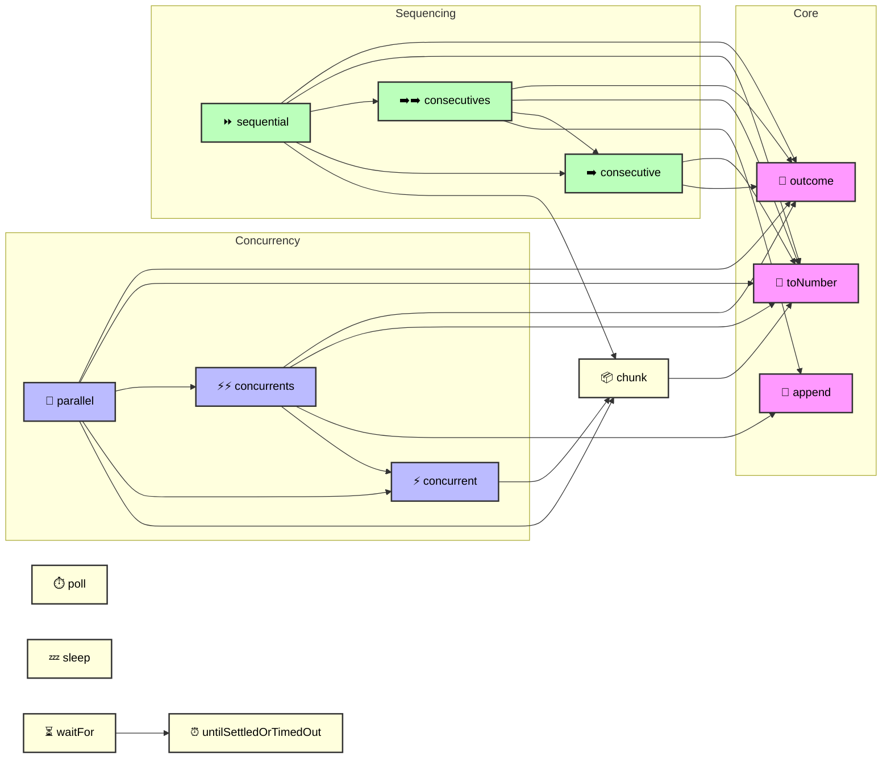

# Timeable Promise

[](https://bit.ly/2YFweqU)
[](https://bit.ly/2YFweqU)
[](https://bit.ly/3MUJErG)
[](https://bit.ly/2JYN1gk)

[](https://bit.ly/43aA0qF)
[](https://bit.ly/2LPRiVj)
[](https://bit.ly/2yP3kGa)
[](https://bit.ly/2yi7gyO)

Collection of asynchronous utilities for managing concurrency,
sequencing, and timing. Provides helpers for running tasks in
parallel or sequential order, controlling execution with timeouts,
and working with settled promise results.

## Installation

```bash
yarn add timeable-promise || npm install --save timeable-promise
```

## Importing

This package supports two styles of import:

1. Named exports from the entry point:
```ts
import { chunk, ..., waitFor } from 'timeable-promise';
```

2. Direct path imports for individual utilities:
```ts
import chunk from 'timeable-promise/chunk';
```

Use whichever style fits your project. Named exports are convenient when you
need several utilities at once, while direct path imports can reduce bundle
size if you only need one.

> This package is written in TypeScript and provides type definitions
> out of the box. Your editor will offer autocomplete and type safety
> automatically.

For the full list of exports, refer to the [API Call Graph](#api-call-graph).

## API Call Graph

The diagram below shows how the exported utilities interact with each other:



## Functions

### append()

```ts
function append<T>(accumulator, array): T[];
```

Defined in: [append.ts:21](https://github.com/rickypc/timeable-promise/blob/main/src/append.ts#L21)

Appends items from one array onto the end of another.

#### Type Parameters

| Type Parameter | Description |
| ------ | ------ |
| `T` | The element type of the array. |

#### Parameters

| Parameter | Type | Description |
| ------ | ------ | ------ |
| `accumulator` | `T`[] | The accumulator array. |
| `array` | `T`[] | The array items that will be appended. |

#### Returns

`T`[]

The appended accumulator array.

#### Example

_Basic append:_
```ts
const appended = append<number>([1, 2], [3, 4]);
console.log(appended); // [1, 2, 3, 4]
```

***

### chunk()

```ts
function chunk<T>(array, size): T[] | T[][];
```

Defined in: [chunk.ts:23](https://github.com/rickypc/timeable-promise/blob/main/src/chunk.ts#L23)

Splits an array into chunks of a given size.
The final chunk will contain the remaining elements.

#### Type Parameters

| Type Parameter | Description |
| ------ | ------ |
| `T` | The element type of the array. |

#### Parameters

| Parameter | Type | Default value | Description |
| ------ | ------ | ------ | ------ |
| `array` | `T`[] | `undefined` | The original array. |
| `size` | `number` | `0` | The group size (default = 0). |

#### Returns

`T`[] \| `T`[][]

A new array containing chunked subarrays,
  or the original array if size is 0.

#### Example

_Chunk into pairs:_
```ts
const chunked = chunk<number>([1, 2, 3, 4, 5], 2);
console.log(chunked); // [[1, 2], [3, 4], [5]]
```

***

### concurrent()

```ts
function concurrent<T>(
   array, 
   executor, 
concurrency): Promise<Settled<T>[]>;
```

Defined in: [concurrent.ts:51](https://github.com/rickypc/timeable-promise/blob/main/src/concurrent.ts#L51)

Runs the executor concurrently across items in a single array.
If a concurrency value is provided, items are grouped into chunks of
that size and each chunk is processed in parallel. The output is always
a settled results array, but the input shape differs: either individual
items or grouped chunks.

#### Type Parameters

| Type Parameter | Description |
| ------ | ------ |
| `T` | The element type of the array. |

#### Parameters

| Parameter | Type | Default value | Description |
| ------ | ------ | ------ | ------ |
| `array` | `T`[] | `undefined` | The array items to be processed by executor. |
| `executor` | [`ArrayExecutor`](#arrayexecutor)\<`T`\> | `undefined` | Executor function applied to each chunk. |
| `concurrency` | `number` | `0` | The maximum concurrent execution size (default = 0). |

#### Returns

`Promise`\<[`Settled`](#settled)\<`T`\>[]\>

A promise resolving to an array of
  settled results.

#### Examples

_With concurrency (groups of size 2):_
```ts
const concurrentSettled1 = await concurrent<number>([1, 2, 3, 4, 5], async (chunk) => {
  return chunk.map(x => x * 2);
}, 2);
console.log(concurrentSettled1);
// [
//   { status: 'fulfilled', value: [2, 4] },
//   { status: 'fulfilled', value: [6, 8] },
//   { status: 'fulfilled', value: [10] }
// ]
```

_Without concurrency (each item processed individually):_
```ts
const concurrentSettled2 = await concurrent<number>([1, 2, 3], async (value) => {
  return value * 2;
});
console.log(concurrentSettled2);
// [
//   { status: 'fulfilled', value: 2 },
//   { status: 'fulfilled', value: 4 },
//   { status: 'fulfilled', value: 6 }
// ]
```

***

### concurrents()

```ts
function concurrents<T>(
   array, 
   executor, 
concurrency): Promise<Settled<T>[]>;
```

Defined in: [concurrents.ts:54](https://github.com/rickypc/timeable-promise/blob/main/src/concurrents.ts#L54)

Runs the executor concurrently across multiple groups of an array.
Internally calls `concurrent` for each group, then appends the results
together. While the output format looks similar to `concurrent`,
the orchestration differs: `concurrents` manages multiple concurrent runs,
whereas `concurrent` handles a single run.

#### Type Parameters

| Type Parameter | Description |
| ------ | ------ |
| `T` | The element type of the array. |

#### Parameters

| Parameter | Type | Default value | Description |
| ------ | ------ | ------ | ------ |
| `array` | `T`[] | `undefined` | The array groups to be processed by executor. |
| `executor` | [`ArrayExecutor`](#arrayexecutor)\<`T`\> | `undefined` | Executor function applied to each group. |
| `concurrency` | `number` | `0` | The maximum concurrent group size (default = 0). |

#### Returns

`Promise`\<[`Settled`](#settled)\<`T`\>[]\>

A promise resolving to an array of
  settled results.

#### Examples

_With concurrency (groups of size 2):_
```ts
const concurrentsSettled1 = await concurrents<number>([1, 2, 3, 4, 5], async (group) => {
  return group.map(x => x * 2);
}, 2);
console.log(concurrentsSettled1);
// [
//   { status: 'fulfilled', value: [2, 4] },
//   { status: 'fulfilled', value: [6, 8] },
//   { status: 'fulfilled', value: [10] }
// ]
```

_Without concurrency (each item treated as its own group):_
```ts
const concurrentsSettled2 = await concurrents<number>([1, 2, 3], async (value) => {
  return value * 2;
});
console.log(concurrentsSettled2);
// [
//   { status: 'fulfilled', value: 2 },
//   { status: 'fulfilled', value: 4 },
//   { status: 'fulfilled', value: 6 }
// ]
```

***

### consecutive()

```ts
function consecutive<T>(
   array, 
   executor, 
concurrency): Promise<Settled<T>[]>;
```

Defined in: [consecutive.ts:51](https://github.com/rickypc/timeable-promise/blob/main/src/consecutive.ts#L51)

Runs the executor sequentially across items in a single array.
If a concurrency value is provided, items are grouped into chunks of that size
and each group is processed one after another. While the output is always a
settled results array, the input shape differs: either individual items or
grouped chunks.

#### Type Parameters

| Type Parameter | Description |
| ------ | ------ |
| `T` | The element type of the array. |

#### Parameters

| Parameter | Type | Default value | Description |
| ------ | ------ | ------ | ------ |
| `array` | `T`[] | `undefined` | The array items to be processed by executor. |
| `executor` | [`ArrayExecutor`](#arrayexecutor)\<`T`\> | `undefined` | Executor function applied to each item or group. |
| `concurrency` | `number` | `0` | The maximum group size (default = 0). |

#### Returns

`Promise`\<[`Settled`](#settled)\<`T`\>[]\>

A promise resolving to an array of
  settled results.

#### Examples

_With concurrency (groups of size 2):_
```ts
const consecutiveSettled1 = await consecutive<number>([1, 2, 3, 4, 5], async (group) => {
  return group.map(x => x * 2);
}, 2);
console.log(consecutiveSettled1);
// [
//   { status: 'fulfilled', value: [2, 4] },
//   { status: 'fulfilled', value: [6, 8] },
//   { status: 'fulfilled', value: [10] }
// ]
```

_Without concurrency (each item processed one by one):_
```ts
const consecutiveSettled2 = await consecutive<number>([1, 2, 3], async (value) => {
  return value * 2;
});
console.log(consecutiveSettled2);
// [
//   { status: 'fulfilled', value: 2 },
//   { status: 'fulfilled', value: 4 },
//   { status: 'fulfilled', value: 6 }
// ]
```

***

### consecutives()

```ts
function consecutives<T>(
   array, 
   executor, 
concurrency): Promise<Settled<T>[]>;
```

Defined in: [consecutives.ts:52](https://github.com/rickypc/timeable-promise/blob/main/src/consecutives.ts#L52)

Runs the executor sequentially across multiple groups of an array.
Internally calls `consecutive` for each group, then appends the results together.
This means the output looks similar to `consecutive`, but the orchestration differs:
`consecutives` manages multiple consecutive runs, while `consecutive` handles a single run.

#### Type Parameters

| Type Parameter | Description |
| ------ | ------ |
| `T` | The element type of the array. |

#### Parameters

| Parameter | Type | Default value | Description |
| ------ | ------ | ------ | ------ |
| `array` | `T`[] | `undefined` | The array groups to be processed by executor. |
| `executor` | [`ArrayExecutor`](#arrayexecutor)\<`T`\> | `undefined` | Executor function applied to each group or item. |
| `concurrency` | `number` | `0` | The maximum group size (default = 0). |

#### Returns

`Promise`\<[`Settled`](#settled)\<`T`\>[]\>

A promise resolving to an array of
  settled results.

#### Examples

_With concurrency (groups of size 2):_
```ts
const consecutivesSettled1 = await consecutives<number>([1, 2, 3, 4, 5], async (group) => {
  return group.map(x => x * 2);
}, 2);
console.log(consecutivesSettled1);
// [
//   { status: 'fulfilled', value: [2, 4] },
//   { status: 'fulfilled', value: [6, 8] },
//   { status: 'fulfilled', value: [10] }
// ]
```

_Without concurrency (each item treated as its own group):_
```ts
const consecutivesSettled2 = await consecutives<number>([1, 2, 3], async (value) => {
  return value * 2;
});
console.log(consecutivesSettled2);
// [
//   { status: 'fulfilled', value: 2 },
//   { status: 'fulfilled', value: 4 },
//   { status: 'fulfilled', value: 6 }
// ]
```

***

### outcome()

```ts
function outcome<T>(executor, ...args): Promise<Settled<T>>;
```

Defined in: [outcome.ts:40](https://github.com/rickypc/timeable-promise/blob/main/src/outcome.ts#L40)

Executes an executor and returns a PromiseSettledResult-like outcome.

#### Type Parameters

| Type Parameter | Description |
| ------ | ------ |
| `T` | The element type of the array. |

#### Parameters

| Parameter | Type | Description |
| ------ | ------ | ------ |
| `executor` | [`ArrayExecutor`](#arrayexecutor)\<`T`\> | Function to execute. |
| ...`args` | \[`T`, `number`, `T`[], `PromiseSettledResult`\<`T`\>[]\] | Arguments passed to the executor. |

#### Returns

`Promise`\<[`Settled`](#settled)\<`T`\>\>

A settled outcome object.

#### Examples

_Fulfilled outcome:_
```ts
const ok = await outcome<number>(async (x: number) => x * 2, 5);
console.log(ok); // { status: 'fulfilled', value: 10 }
```

_Rejected outcome:_
```ts
const err = await outcome(() => { throw new Error('fail'); });
console.log(err); // { reason: Error('fail'), status: 'rejected' }
```

***

### parallel()

```ts
function parallel<T>(
   array, 
   executor, 
concurrency): Promise<Settled<T>[]>;
```

Defined in: [parallel.ts:53](https://github.com/rickypc/timeable-promise/blob/main/src/parallel.ts#L53)

Provides parallel execution of an executor across array items.
If a concurrency value is provided, items are grouped into chunks of that size
and processed concurrently via `concurrents`. Otherwise, the entire array is
processed concurrently via `concurrent`.

#### Type Parameters

| Type Parameter | Description |
| ------ | ------ |
| `T` | The element type of the array. |

#### Parameters

| Parameter | Type | Default value | Description |
| ------ | ------ | ------ | ------ |
| `array` | `T`[] | `undefined` | The array that is being processed in parallel. |
| `executor` | [`ArrayExecutor`](#arrayexecutor)\<`T`\> | `undefined` | Executor function applied to each item or group. |
| `concurrency` | `number` | `0` | The maximum group size (default = 0). |

#### Returns

`Promise`\<[`Settled`](#settled)\<`T`\>[]\>

A promise resolving to an array of settled
  results.

#### Examples

_With concurrency (groups of size 2):_
```ts
const parallelSettled1 = await parallel<number>([1, 2, 3, 4, 5], async (group) => {
  return group.map(x => x * 2);
}, 2);
console.log(parallelSettled1);
// [
//   { status: 'fulfilled', value: [2, 4] },
//   { status: 'fulfilled', value: [6, 8] },
//   { status: 'fulfilled', value: [10] }
// ]
```

_Without concurrency (all items processed concurrently):_
```ts
const parallelSettled2 = await parallel<number>([1, 2, 3], async (value) => {
  return value * 2;
});
console.log(parallelSettled2);
// [
//   { status: 'fulfilled', value: 2 },
//   { status: 'fulfilled', value: 4 },
//   { status: 'fulfilled', value: 6 }
// ]
```

***

### poll()

```ts
function poll(
   executor, 
   interval, 
   immediately): PollHandle;
```

Defined in: [poll.ts:41](https://github.com/rickypc/timeable-promise/blob/main/src/poll.ts#L41)

Provides polling support without congestion when the executor takes longer
than the interval. The executor receives a `stopped` function to check
if polling has been stopped.

#### Parameters

| Parameter | Type | Default value | Description |
| ------ | ------ | ------ | ------ |
| `executor` | [`PollExecutor`](#pollexecutor) | `undefined` | Function invoked on each poll. Receives a `stopped` function. |
| `interval` | `number` | `1000` | Delay interval in milliseconds (default = 1000). |
| `immediately` | `boolean` | `false` | Whether to run executor immediately at the beginning (default = false). |

#### Returns

[`PollHandle`](#pollhandle)

An object with a `stop` function to end polling.

#### Example

_Basic polling with stop control:_
```ts
const timer = poll((stopped) => {
  // Do something promising here...
  if (!stopped()) {
    // Do something when polling is not stopped...
  }
}, 100);

setTimeout(() => {
  // Simulate the end of polling.
  timer.stop();
}, 1000);
```

***

### sequential()

```ts
function sequential<T>(
   array, 
   executor, 
concurrency): Promise<Settled<T>[]>;
```

Defined in: [sequential.ts:53](https://github.com/rickypc/timeable-promise/blob/main/src/sequential.ts#L53)

Provides sequential execution of an executor across array items.
If a concurrency value is provided, items are grouped into chunks of that size
and processed sequentially via `consecutives`. Otherwise, the entire array is
processed sequentially via `consecutive`.

#### Type Parameters

| Type Parameter | Description |
| ------ | ------ |
| `T` | The element type of the array. |

#### Parameters

| Parameter | Type | Default value | Description |
| ------ | ------ | ------ | ------ |
| `array` | `T`[] | `undefined` | The array that is being processed sequentially. |
| `executor` | [`ArrayExecutor`](#arrayexecutor)\<`T`\> | `undefined` | Executor function applied to each item or group. |
| `concurrency` | `number` | `0` | The maximum group size (default = 0). |

#### Returns

`Promise`\<[`Settled`](#settled)\<`T`\>[]\>

A promise resolving to an array of
  settled results.

#### Examples

_With concurrency (groups of size 2):_
```ts
const sequentialSettled1 = await sequential<number>([1, 2, 3, 4, 5], async (group) => {
  return group.map(x => x * 2);
}, 2);
console.log(sequentialSettled1);
// [
//   { status: 'fulfilled', value: [2, 4] },
//   { status: 'fulfilled', value: [6, 8] },
//   { status: 'fulfilled', value: [10] }
// ]
```

_Without concurrency (all items processed one by one):_
```ts
const sequentialSettled2 = await sequential<number>([1, 2, 3], async (value) => {
  return value * 2;
});
console.log(sequentialSettled2);
// [
//   { status: 'fulfilled', value: 2 },
//   { status: 'fulfilled', value: 4 },
//   { status: 'fulfilled', value: 6 }
// ]
```

***

### sleep()

```ts
function sleep(timeout): Promise<void>;
```

Defined in: [sleep.ts:20](https://github.com/rickypc/timeable-promise/blob/main/src/sleep.ts#L20)

Suspends execution for the given timeout duration.

#### Parameters

| Parameter | Type | Description |
| ------ | ------ | ------ |
| `timeout` | `number` | Timeout in milliseconds. |

#### Returns

`Promise`\<`void`\>

A promise that resolves after the given timeout.

#### Example

_Sleep for 1 second:_
```ts
console.time('sleep');
await sleep(1000);
console.timeEnd('sleep');
```

***

### toNumber()

```ts
function toNumber(value, defaultValue): number;
```

Defined in: [toNumber.ts:30](https://github.com/rickypc/timeable-promise/blob/main/src/toNumber.ts#L30)

Converts a value to a number. If conversion fails, returns the default value.

#### Parameters

| Parameter | Type | Default value | Description |
| ------ | ------ | ------ | ------ |
| `value` | `unknown` | `undefined` | The value to convert. |
| `defaultValue` | `number` | `0` | The fallback if conversion is invalid (default = 0). |

#### Returns

`number`

A numeric value.

#### Examples

_Convert string to number:_
```ts
console.log(toNumber('42'));        // 42
```

_Fallback value when conversion fails:_
```ts
console.log(toNumber('abc', 10));   // 10
```

_Null input defaults to 0:_
```ts
console.log(toNumber(null));        // 0
```

***

### untilSettledOrTimedOut()

```ts
function untilSettledOrTimedOut<T>(
   executor, 
   timeoutExecutor, 
timeout): Promise<T>;
```

Defined in: [untilSettledOrTimedOut.ts:65](https://github.com/rickypc/timeable-promise/blob/main/src/untilSettledOrTimedOut.ts#L65)

Provides timeout support for a Promise. The executor runs until either
it settles or the timeout expires, in which case the timeoutExecutor
is invoked.

#### Type Parameters

| Type Parameter | Description |
| ------ | ------ |
| `T` | The type of the resolved return value. |

#### Parameters

| Parameter | Type | Description |
| ------ | ------ | ------ |
| `executor` | [`PromiseExecutor`](#promiseexecutor)\<`T`\> | Executor function, receives resolve, reject, and a `pending` function. |
| `timeoutExecutor` | [`TimeoutExecutor`](#timeoutexecutor)\<`T`\> | Function invoked if timeout occurs, receives resolve and reject. |
| `timeout` | `number` | Timeout in milliseconds. |

#### Returns

`Promise`\<`T`\>

A promise resolving or rejecting with the executor
  or timeoutExecutor result.

#### Example

_Executor with timeout fallback:_
```ts
const executor = (resolve, reject, pending) => {
  // Do something promising here...
  if (pending()) {
    try {
      // Do something more promising here...
      resolve(true);
    } catch (ex) {
      reject(false);
    }
  }
};

const timeoutExecutor = (resolve, reject) => {
  try {
    resolve(true);
  } catch (ex) {
    reject(false);
  }
};

const timeout = 5000;
const response = await untilSettledOrTimedOut<boolean>(executor, timeoutExecutor, timeout)
  .catch(ex => console.log('nay :(', ex));
console.log(`resolved with ${response}, yay!`);
```

***

### waitFor()

```ts
function waitFor(
   predicate, 
   timeout, 
interval): Promise<void>;
```

Defined in: [waitFor.ts:34](https://github.com/rickypc/timeable-promise/blob/main/src/waitFor.ts#L34)

Wait until a predicate returns true or timeout occurs.

#### Parameters

| Parameter | Type | Default value | Description |
| ------ | ------ | ------ | ------ |
| `predicate` | () => `boolean` | `undefined` | Function returning a boolean, checked repeatedly. |
| `timeout` | `number` | `undefined` | Max time to wait in ms. |
| `interval` | `number` | `1000` | Polling interval in ms (default = 1000). |

#### Returns

`Promise`\<`void`\>

A promise that resolves when predicate is true or
  timeout expires.

#### Example

_Wait for predicate to become true:_
```ts
let inflight = true;
const predicate = () => !inflight;
const timeout = 5000;

setTimeout(() => {
  inflight = false; // long process done
}, 1000);

console.time('waitFor');
await waitFor(predicate, timeout, 200);
console.timeEnd('waitFor');
```

## Type Aliases

### ArrayExecutor()

```ts
type ArrayExecutor<T> = (value, index, array, accumulator?) => T | Promise<T>;
```

Defined in: [outcome.ts:8](https://github.com/rickypc/timeable-promise/blob/main/src/outcome.ts#L8)

#### Type Parameters

| Type Parameter |
| ------ |
| `T` |

#### Parameters

| Parameter | Type |
| ------ | ------ |
| `value` | `T` |
| `index` | `number` |
| `array` | `T`[] |
| `accumulator?` | `PromiseSettledResult`\<`T`\>[] |

#### Returns

`T` \| `Promise`\<`T`\>

***

### PollExecutor()

```ts
type PollExecutor = (stopped) => Promise<void> | void;
```

Defined in: [poll.ts:9](https://github.com/rickypc/timeable-promise/blob/main/src/poll.ts#L9)

#### Parameters

| Parameter | Type |
| ------ | ------ |
| `stopped` | () => `boolean` |

#### Returns

`Promise`\<`void`\> \| `void`

***

### PollHandle

```ts
type PollHandle = {
  stop: () => void;
};
```

Defined in: [poll.ts:11](https://github.com/rickypc/timeable-promise/blob/main/src/poll.ts#L11)

#### Properties

| Property | Type | Defined in |
| ------ | ------ | ------ |
| <a id="stop"></a> `stop` | () => `void` | [poll.ts:12](https://github.com/rickypc/timeable-promise/blob/main/src/poll.ts#L12) |

***

### PromiseExecutor()

```ts
type PromiseExecutor<T> = (resolve, reject, pending) => void;
```

Defined in: [untilSettledOrTimedOut.ts:8](https://github.com/rickypc/timeable-promise/blob/main/src/untilSettledOrTimedOut.ts#L8)

#### Type Parameters

| Type Parameter |
| ------ |
| `T` |

#### Parameters

| Parameter | Type |
| ------ | ------ |
| `resolve` | (`value`) => `void` |
| `reject` | (`reason?`) => `void` |
| `pending` | () => `boolean` |

#### Returns

`void`

***

### Settled

```ts
type Settled<T> = PromiseSettledResult<T>;
```

Defined in: [outcome.ts:19](https://github.com/rickypc/timeable-promise/blob/main/src/outcome.ts#L19)

#### Type Parameters

| Type Parameter |
| ------ |
| `T` |

***

### TimeoutExecutor()

```ts
type TimeoutExecutor<T> = (resolve, reject) => void;
```

Defined in: [untilSettledOrTimedOut.ts:17](https://github.com/rickypc/timeable-promise/blob/main/src/untilSettledOrTimedOut.ts#L17)

#### Type Parameters

| Type Parameter |
| ------ |
| `T` |

#### Parameters

| Parameter | Type |
| ------ | ------ |
| `resolve` | (`value`) => `void` |
| `reject` | (`reason?`) => `void` |

#### Returns

`void`

## Development Dependencies

You will need to install [Node.js](https://bit.ly/2SMCGXK) as a local
development dependency. The `npm` package manager comes bundled with all
recent releases of `Node.js`. You can also use [yarn](https://bit.ly/3nmWS1K)
as a package manager.

`yarn` or `npm install` will attempt to resolve any `npm` module dependencies
that have been declared in the project's `package.json` file, installing them
into the `node_modules` folder.

```bash
yarn || npm install
```

Run Leak, Lint, Performance, Type and Unit Tests
-
To make sure we did not break anything, let's run all the tests:

```bash
yarn test || npm run test
```

Run leak tests only:

```bash
yarn test:leak || npm run test:leak
```

Run linter only:

```bash
yarn test:lint || npm run test:lint
```

Run performance tests only:

```bash
yarn test:perf || npm run test:perf
```

Run type check only:

```bash
yarn test:type || npm run test:type
```

Run unit tests only:

```bash
yarn test:unit || npm run test:unit
```

## Contributing

If you would like to contribute code to Timeable Promise repository you can do so
through GitHub by forking the repository and sending a pull request.

If you do not agree to [Contribution Agreement](CONTRIBUTING.md), do not
contribute any code to Timeable Promise repository.

When submitting code, please make every effort to follow existing conventions
and style in order to keep the code as readable as possible. Please also include
appropriate test cases.

That's it! Thank you for your contribution!

## License

Copyright (c) 2018-2025 Richard Huang.

This module is free software, licensed under:
[GNU Affero General Public License (AGPL-3.0)](https://bit.ly/2yi7gyO).

Documentation and other similar content are provided under
[Creative Commons Attribution-NonCommercial-ShareAlike 4.0 International License](https://bit.ly/2SMCRlS).
